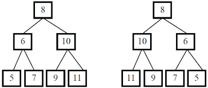

# 简介
请完成一个函数, 输入一棵二叉树, 该函数输出它的镜像。

# 实现
首先, 要明确一下镜像的定义。如下两棵树便是互为镜像的二叉树。



要得到二叉树的镜像, 首先我们要交换根节点的左右节点。
之后再进行递归, 交换左子树和右子树, 直到所有节点的左右子树都被交换了位置为止。

```js
function mirrorRecursively(root) {
    if (!root) {
        return root;
    }

    // 交换左右子树
    [root.left, root.right] = [root.right, root.left];

    // 递归交换左子树的节点
    mirrorRecursively(root.left);
    // 递归交换右子树的节点
    mirrorRecursively(root.right);

    return root;
}
```

还有一种实现方法, 那就是使用队列模拟递归过程。实现如下:

```js
function mirrorRecursively(root) {
    if (!root) {
        return root;
    }

    let queue = [root];

    while (queue.length > 0) {
        // 从头部取出需要进行下一步交换的树
        let node = queue.shift();

        // 如果树的左子树不为空, 将其加入到队列中
        if (node.left !== null) {
            queue.push(node.left);
        }

        // 如果树的右子树不为空, 将其加入到队列中
        if (node.right !== null) {
            queue.push(node.right);
        }

        // 交换左右子树
        [node.left, node.right] = [node.right, node.left];
    }

    return root;
}
```