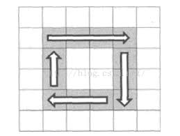
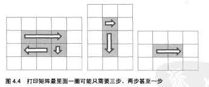

# 简介
输入一个矩阵, 按照从外向里以顺时针的顺序依次打印出数字。

# 实现
这道题要小心的是矩阵打印的边界。编写代码时, 可以用四个变量储存矩阵剩余节点的四个角的坐标。
对于不同的矩阵, 打印时共有四种情况, 分别如下:





实现如下:
```js
function printMatrix(matrix) {
        // 矩阵为空
        if (!matrix || matrix.length === 0) {
            return;
        }

        let top = 0;
        let bottom = matrix.length;
        let left = 0;
        let right = matrix[0].length;

        // 矩阵不为空
        printMatrixCore(matrix, top, bottom, left, right);
    }

    function printMatrixCore(matrix, top, bottom, left, right) {
        if (top > bottom || left > right) {
            return;
        }

        // 从左到右的横行
        if (right - left >= 1) {
            for (let i = left; i < right; i++) {
                console.log(matrix[top][i]);
            }
        }

        // 从上到下的竖行
        if (bottom - top > 1) {
            for (let i = top + 1; i < bottom; i++) {
                console.log(matrix[i][right - 1]);
            }
        }

        // 从右到左的横行
        if (right - left > 1 && bottom - top > 1) {
            for (let i = right - 2; i >= left; i--) {
                console.log(matrix[bottom - 1][i]);
            }
        }

        // 从下到上的竖行
        if (bottom - top > 1 && right - left > 1) {
            for (let i = bottom - 2; i > top; i--) {
                console.log(matrix[i][left]);
            }
        }

        printMatrixCore(matrix, top + 1, bottom - 1, left + 1, right - 1);
    }
```